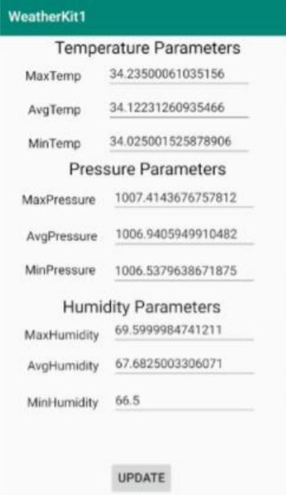

<h1> Smart Weather Monitoring System</h1>

 This repository provides the code for an Android app that can fetch a JSON file with a request responce model and display the latest temperature, humidity parameters.
 

 The project included a weather station fromed with DHT22 (Temperature sensor) and BMP180 (Humidity sensor) sensors interfaced with RasperryPi. The data was periodically sent to the ThingSpeak Cloud.
 

 The Android application facilitates fetching a set of recent values from the cloud and analysing them upon retrieval.
 
</img>
<h2> How to use this?</h2>
<ul type="disc">
<li>Open mainActivity.java and search for the variable holding the READAPI address</li>
<li>Replace it with your own API.</li>
</ul>
